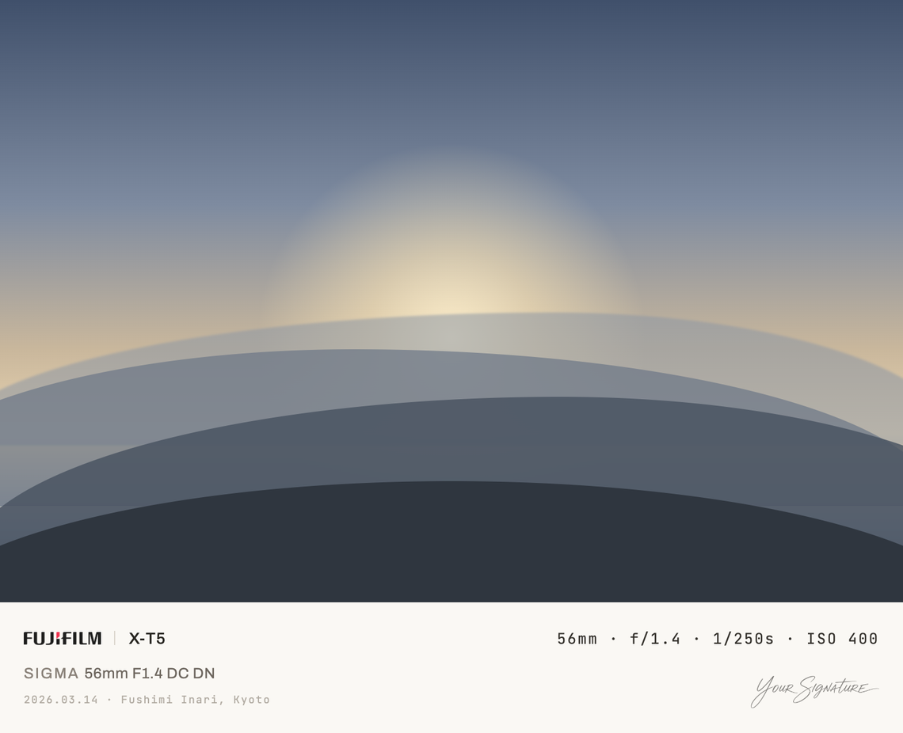
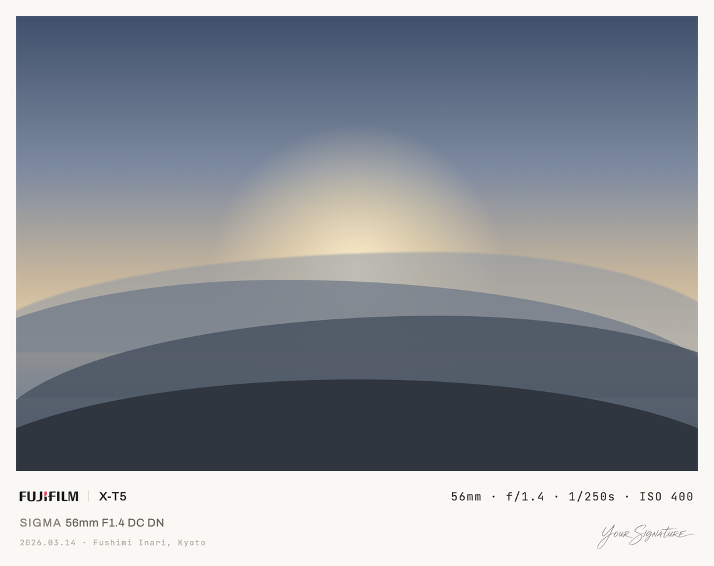
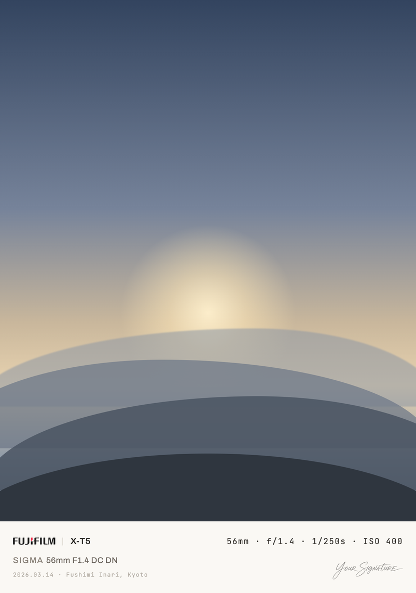
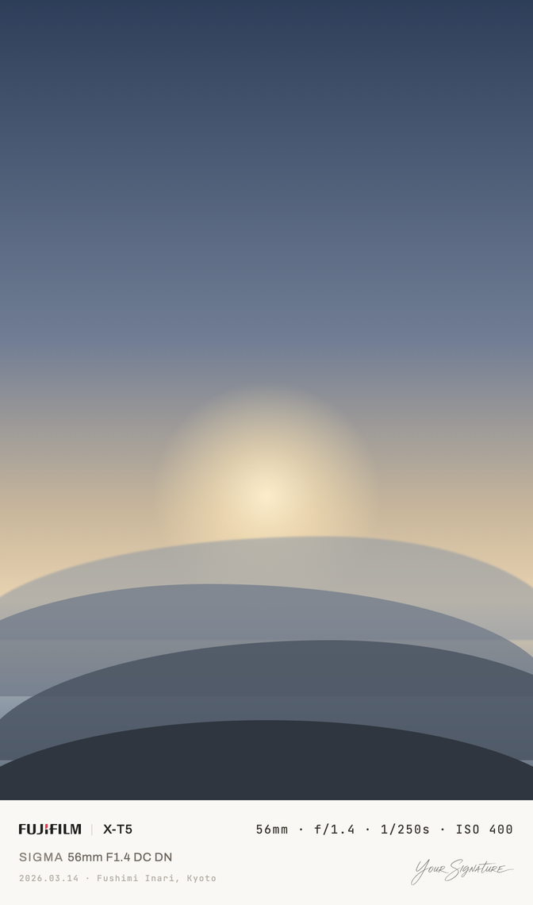

# exifcard

A local CLI tool that turns a photo and its EXIF data into a finished card image: the photo on top, a quiet metadata strip below, written out as a single flat image file.

It is built for personal album archiving and the occasional share, not for social platforms. The output is an image, not a web page — no buttons, no device frames, no interactive elements.

## Demo

The same layout across four aspect ratios and both border modes. The photos are stand-ins and the signature is a sample, not a real one.

| `bleed` — for screens | `equal` — for print, with a faint inset hairline |
|---|---|
|  |  |

| 1:1 | 4:5 | 2:3 |
|---|---|---|
|  |  |  |

The info strip is identical in all four: same type sizes, same padding, same alignment. It does not move with the photo's proportions, so a whole album stacks evenly.

## Install

```sh
uv tool install git+https://github.com/RxChi1d/exifcard
playwright install chromium
```

Chromium renders the info strip — see [How it works](#how-it-works). Optionally install `jpegtran` (macOS `brew install jpeg-turbo`, Debian/Ubuntu `apt install libjpeg-turbo-progs`) if you want `--lossless`.

## Use

```sh
exifcard render photo.jpg                       # one photo
exifcard render ./kyoto/ --location "Kyoto"     # a whole folder, one caption
exifcard render ./kyoto/ --dry-run              # show what would be written
```

Cards land in `outputs/<folder name>/`. The source folder is never written to, so pointing the tool at a backup or a photo library leaves it untouched.

Existing cards prompt before being replaced (`y`/`N`/`a`ll/`s`kip/`q`uit), or pass `--force` or `--skip-existing` to answer in advance. In a non-interactive shell an existing file is an error rather than a silent overwrite.

### Per-photo captions

A coordinate has many true names at once — a road, a neighbourhood, a ward, a city — and none of them is reliably the one the photograph is about. `Fushimi Inari` is a choice about what the picture shows, so captions are written by hand. The tool only saves you from typing filenames:

```sh
exifcard locations ./kyoto/          # append every photo to a locations.toml
```

```toml
# outputs/kyoto/locations.toml
# 2026.03.14 X-T5
"DSCF1234.JPG" = "Fushimi Inari, Kyoto"
# 2026.03.14 X-T5
"DSCF1240.JPG" = ""
```

Empty means no location, which is a designed state: the date line simply stands alone. Re-running only appends new files; your captions, comments and ordering are never touched.

### Configuration

```sh
exifcard config-example > ~/.config/exifcard/config.toml
```

Holds the things that are stable across every album — the path to your signature, and the display-name tables:

```toml
signature = "~/Pictures/private/signature.png"

[gear.body]
"ILCE-7CM2" = "α7C II"

[gear.lens]
"TAMRON 25-200mm F2.8-5.6 A075 E" = "25-200mm F2.8-5.6"
```

Gear names appear exactly as EXIF reports them unless a table renames them, so an unregistered camera still produces a correct card.

## What the card shows

Camera brand logo, body model, lens brand (only when it differs from the body's), lens model, focal length, aperture, shutter speed, ISO, date, an optional location, and an optional handwritten signature.

Anything EXIF does not supply is left out — a manual lens reports no aperture, so the readout simply has one fewer value. Nothing is ever replaced with `Unknown` or a dash, and the strip keeps its height either way.

Bundled marks cover cameras — Canon, Fujifilm, Hasselblad, Leica, LUMIX, Nikon, Olympus, OM System, Pentax, Ricoh, Sigma, Sony — and phones, since a phone is the camera that took the photo: Apple, ASUS, Google, HONOR, Huawei, Motorola, OnePlus, OPPO, Samsung, vivo, Xiaomi. Wordmarks where one exists in the public domain, the maker's square emblem where it does not.

Anything else falls back to the maker's name set in type, which the design specifies as a first-class state rather than a failure.

## Output

Format follows the input (`jpg`, `png`, `heic`) unless `--format` says otherwise, which keeps each file on the encoder that suits it.

Defaults are lossy, because a card is a derivative made for looking at while the original stays in your library. What they will not do is throw away more than they have to: a JPEG is re-encoded with the quantization tables and chroma sampling read off the source rather than a guessed quality number. On a 33MP camera file, `--quality 95` would produce 6MB from an 18.8MB original; matching the source's own tables produces 18.9MB with a fifth of the deviation.

`--quality` is passed straight to the encoder, so its scale differs per format and the numbers are not comparable — `heic 70` is roughly `jpg 95`.

`--lossless` composites at the DCT level with `jpegtran`, so the photo's coefficients are copied into the card untouched and the photo area is bit-for-bit identical to the source. It requires a JPEG whose dimensions are multiples of 16, and it fails with an explanation rather than quietly falling back.

Output is the photo's native resolution by default. Compression discards what you cannot see; resolution is visible and irreversible, so shrinking is left to an explicit `--width`.

## How it works

The photo and the info strip never overlap, so they are made separately and joined:

```
Chromium renders only the strip        Pillow assembles the card
┌──────────────────┐                   ┌──────────────────┐
│                  │                   │  photo bytes,    │
│   (no photo)     │                   │  untouched       │
├──────────────────┤                   ├──────────────────┤
│  7008 × 590      │  ───────────────> │  strip           │
└──────────────────┘                   └──────────────────┘
```

The browser is there for text: letter-spacing, baseline alignment and edge-to-edge distribution at exactly the values the design specifies, rather than reimplemented approximately in a drawing library. Because it only ever sees the strip, the photo is never re-sampled, never converted between colour spaces, and never limited by the browser's maximum surface size.

Fonts (Archivo, JetBrains Mono, Noto Sans) ship with the package, so a card renders identically on any machine. Layout is defined once at a 760px baseline and scaled as a whole, so text never reflows between output sizes.

## License

MIT. Free to use, modify, and sell, including commercially; keep the copyright and license notice with any substantial portion you redistribute. See [LICENSE](LICENSE).

Bundled fonts are SIL Open Font License 1.1 (see `src/exifcard/assets/fonts/`). Bundled brand wordmarks are public domain (`PD-textlogo`) with their sources recorded in `src/exifcard/assets/logos/logos.toml`; they remain trademarks of their owners and are used here only to identify the camera a photo was taken with.
