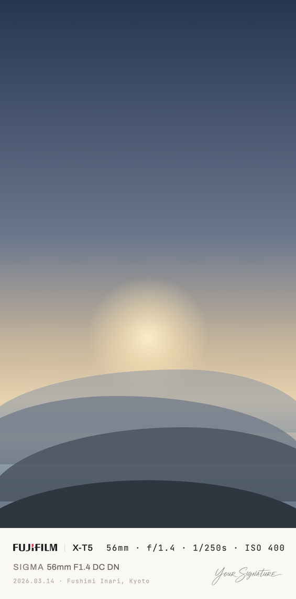

[English](README.md) | **繁體中文**

# exifcard

exifcard 是一個本機 CLI 工具。它把照片與它的 EXIF 資料做成一張成品卡片圖：照片在上，下方是一條安靜的資訊列，輸出為單一張平面圖片檔。

它是為了個人相簿存檔與偶爾分享而做的，不是為了社群平台。產出是一張圖片，不是網頁。它沒有按鈕、沒有裝置外框，也沒有任何互動元件。

## Demo

以下是同一套版面套用在五種比例與兩種邊框模式上。照片是示意用的替代圖，簽名是範例簽名，不是真的。

| `bleed`：螢幕用 | `equal`：列印用，含極淡的內框線 |
|---|---|
|  |  |

| 1:1 | 4:5 | 2:3 | 9:16 |
|---|---|---|---|
|  |  |  |  |

每一張卡片都用相同的比例與相同的對齊，直幅沒有另做一套。只有字級會做補償，讓直幅卡片在與橫幅卡片相同高度下閱讀時，字看起來一樣大。

## 安裝

```sh
git clone https://github.com/RxChi1d/exifcard && cd exifcard
uv sync
```

`uv sync` 會安裝 `uv.lock` 裡鎖定的確切相依版本，也就是這個工具實際被測試過的那一組。這件事在這裡比一般專案更要緊。HEIC 編碼、JPEG 量化表直傳與無損合成，全都建立在相依套件**沒有寫進文件**的行為上，所以版本漂移可能直接讓某個格式壞掉，而不只是讓某個數字改變。

若要使用 `--lossless`，需另外安裝 `jpegtran`：macOS 用 `brew install jpeg-turbo`，Debian 與 Ubuntu 用 `apt install libjpeg-turbo-progs`。

### 安裝成全域指令

若要讓 `exifcard` 在任何位置都能直接呼叫：

```sh
uv tool install git+https://github.com/RxChi1d/exifcard
```

代價是 tool 安裝會**重新解析**相依，而不是讀取 `uv.lock`。你拿到的是安裝當天符合版本範圍的那一組，不是測試實際跑過的那一組。

### Agent skill

如果你平常透過 coding agent 工作，本專案另外附了一份 [Agent Skill](https://agentskills.io)：

```sh
npx skills add RxChi1d/exifcard
```

安裝器會問要裝進哪個 agent。它裝在當前專案；加上 `--global` 則改裝到你的使用者帳號，這樣不管照片放在哪個資料夾都用得到。要哪一種由你決定。

這份 skill 告訴 agent 這個工具是做什麼的、哪個指令負責什麼，以及動手之前重要的幾條規則：它不會替你代寫地點說明、`--lossless` 只會失敗而不會悄悄降級、在非互動 shell 裡遇到既有卡片是錯誤。這份 skill 刻意寫得短，因為參數的權威仍然是 `--help`。

若安裝器沒有涵蓋你用的 agent，直接請它自己裝：

```
Install the Agent Skill at https://github.com/RxChi1d/exifcard/tree/main/skills/exifcard
into the skills directory you read. Ask me first whether to install it for this
project or for my user account.
```

## 使用

從 clone 執行時，下列指令前面加 `uv run`。若要在照片所在的任何目錄執行，再加上 `--project /path/to/exifcard`。裝成全域指令則不需要前綴。

```sh
uv run exifcard render photo.jpg                     # 單張照片
uv run exifcard render ./kyoto/ --location "Kyoto"   # 整個資料夾，共用一個地點
uv run exifcard render ./kyoto/ --dry-run            # 只列出會寫出什麼，不寫檔
```

第一次執行時你手上不會有簽名檔，所以本專案附了一個，可以直接拿來試這個功能：

```sh
uv run exifcard render photo.jpg --signature examples/signature.png
```

exifcard 全程不寫入來源資料夾，所以把工具指向備份或圖庫都不會動到裡面的東西。

卡片會落在 `outputs/<來源資料夾名稱>/`，並鏡射來源的目錄結構。一次傳入兩個相簿不會混在一起。`--recursive` 也會讓子目錄維持巢狀，而不是把不同相簿的子資料夾攤平到同一個目錄。

覆寫既有卡片前會先詢問（`y`/`N`/`a`ll/`s`kip/`q`uit）。也可以用 `--force` 或 `--skip-existing` 事先回答。在非互動的 shell 中，遇到既有檔案會直接報錯，而不是靜默覆寫。

讀不開的檔案不會中止整批。批次會跑完、列出失敗的檔案，並以非零狀態碼結束：

```
198 written, 0 skipped, 2 failed -> outputs/kyoto
failed:
  DSC00123.JPG  --lossless is not possible here: the photo is 3000x2002, not a multiple of 16
  DSC00456.JPG  cannot identify image file
```

### 逐張照片的地點說明

一組座標同時擁有許多個都正確的名字：一條路、一個街區、一個行政區、一座城市。其中沒有哪一個必然就是這張照片在講的地方。`Fushimi Inari` 是關於「這張照片拍的是什麼」的選擇，所以地點由人手寫。工具只負責省下打檔名的功夫：

```sh
uv run exifcard locations ./kyoto/     # 把每張照片附加到 locations.toml
```

```toml
# outputs/kyoto/locations.toml
# 2026.03.14 X-T5
"DSCF1234.JPG" = "Fushimi Inari, Kyoto"
# 2026.03.14 X-T5
"DSCF1240.JPG" = ""
```

留空代表不顯示地點。那是設計好的狀態：日期那行單獨存在即可。重新執行只會附加新檔案，你填的說明、自己加的註解與排序都不會被更動。

地點說明有寬度預算。卡片的字級是由照片比例與器材名決定的，地點不被允許為了容納自己而縮小卡片其餘部分。「日期 · 地點」那一行剩下的空間如下：

| 卡片 | 整行可用 | 扣掉 `YYYY.MM.DD · ` 前綴後 | 漢字數 |
|---|---|---|---|
| 3:2 橫幅、有簽名 | 592 | 510 | 58 |
| 3:2 橫幅、無簽名 | 720 | 638 | 73 |
| 9:16 直幅、有簽名 | 282 | 200 | 22 |

單位是設計像素而不是輸出像素，所以這些數字在任何卡片尺寸下都成立。預算是寬度而不是字數，因為拉丁字母沒有穩定的字數：`Fushimi Inari, Kyoto` 在最緊的那一欄佔掉 282 之中的 208，還能再放一個短詞，但換成二十個 `i` 則還能再放四十個。漢字有穩定字數，就是最後那一欄，因為每一款 CJK 字型都畫在一個全形方框裡。那一欄刻意向下取整，比實際塞得下的少一到兩個字。一個可以放心寫到底的數字，比多榨出來的那一個字有價值。地點超出預算時，該張照片會失敗並報出差多少，讓你知道要改哪一行，而不是把字印在簽名上。

### 中文、日文與韓文

exifcard 不內建 CJK 字型。那些檔案 9 到 17MB，多數使用者用不到，而且該用哪一款取決於你在哪裡拍照。改成在設定檔登記你要用的字型，你機器上的任何檔案都可以：

```toml
fonts = ["~/Library/Fonts/NotoSansTC-Regular.otf", "~/Library/Fonts/NotoSansJP-Regular.otf"]
```

exifcard 會依你列出的順序、逐字、排在內建字型之後嘗試它們。器材名與曝光讀數因此維持設計原本的字體，只有內建字型畫不出來的字才會落到這裡。exifcard **不會依語言自動選字型**：`京都` 在中文與日文是同樣的兩個碼位，所以要用哪一種字形，由你透過排序決定。當同一行地點是由不只一個檔案畫出來的時候，執行結果會說明哪些字來自哪一款，因為那一行裡的字形設計已經不一致了。

漢字以日期字級的 88% 排版，那是它的字面墨跡與數字墨跡等高的比例。不做這個補償，地名會壓過旁邊的日期，而這一行是整張卡片最安靜的一行，方向剛好相反。

### 設定檔

```sh
uv run exifcard config-example > ~/.config/exifcard/config.toml
```

設定檔放的是跨相簿都穩定的東西：簽名檔路徑，以及顯示名稱對照表。

```toml
signature = "~/Pictures/private/signature.png"

[gear.body]
"ILCE-7CM2" = "α7C II"

[gear.lens]
"TAMRON 25-200mm F2.8-5.6 A075 E" = "25-200mm F2.8-5.6 Di III RXD"
```

器材名稱一律照 EXIF 原樣顯示，除非對照表裡有替換規則，所以沒登記過的相機一樣能產出正確的卡片。

## 卡片上有什麼

卡片上有相機品牌標誌、機身型號、鏡頭品牌（僅在與機身品牌不同時顯示）、鏡頭型號、焦段、光圈、快門、ISO、日期、可選的地點，以及可選的手寫簽名。

**焦段顯示的是 35mm 等效焦距**，不是鏡頭上刻的數字。所以 X-E5 在 17mm 會印成 `26mm`，iPhone 會印成 `23mm` 而不是 `2mm`。沒有記錄等效值的相機（多半是較舊的 DSLR）退回實體焦距。兩者都沒有的照片，卡片上就不會有焦段這一項。（[原因](docs/design.zh-TW.md#焦距)。）

EXIF 沒有提供的一律省略。手動鏡不回報光圈，曝光讀數就少一項。任何欄位都不會被替換成 `Unknown` 或破折號，而資訊列的高度兩種情況下都一樣。

內建的品牌標誌涵蓋相機：Canon、Fujifilm、Hasselblad、Leica、LUMIX、Nikon、Olympus、OM System、Pentax、Ricoh、Sigma、Sony。也涵蓋手機，因為手機就是拍下這張照片的相機：Apple、ASUS、Google、HONOR、Huawei、Motorola、OnePlus、OPPO、Samsung、vivo、Xiaomi。公有領域裡有字標的就用字標，沒有的就用該廠牌的方形徽標。

其餘品牌會退回以文字排出廠牌名稱。這在設計上是一個正式的狀態，不是失敗。

## 輸出

輸出格式跟隨輸入（`jpg`、`png`、`heic`），除非用 `--format` 指定。這讓每個檔案都待在最適合它的編碼器上。

預設是有損的，因為卡片是拿來看的衍生作品，原檔仍留在你的圖庫裡。以一個 33MP 的相機檔為例，預設會從 18.8 MB 產出 6.8 MB，偏差在任何觀看尺度下都看不出來。它也沿用相機的色度取樣，所以拍成 4:2:2 的機身不會被悄悄砍成 4:2:0。（[量測數據](docs/design.zh-TW.md#編碼預設)。）

`--quality` 會直接傳給該格式的編碼器，所以刻度因格式而異，數字之間不可比較。`heic 70` 大約相當於 `jpg 95`。

`--lossless` 用 `jpegtran` 在 DCT 係數層合成。照片的係數原封不動地搬進卡片，照片區與來源位元完全相同。它要求照片的長寬都是 16 的倍數，做不到時會明確報錯，而不是靜默退回。（[為何需要外部二進位](docs/design.zh-TW.md#無損合成)。）

輸出預設使用照片的原生解析度。壓縮丟掉的是你看不見的東西，解析度的損失則看得見且不可逆，所以縮小這件事留給你用 `--width` 明確指定。

## 運作方式

照片與資訊列從不重疊，所以 exifcard 分開製作兩者，再把它們合併：

```
Typst 只排資訊列                       Pillow 組裝卡片
┌──────────────────┐                   ┌──────────────────┐
│                  │                   │  照片位元組       │
│   （沒有照片）     │                   │  原封不動         │
├──────────────────┤                   ├──────────────────┤
│  7008 × 590      │  ───────────────> │  資訊列           │
└──────────────────┘                   └──────────────────┘
```

排版引擎存在的理由是文字：字距，以及字體自己的字偶間距，全部精確等於設計稿的數值。exifcard 先以設計單位算好每個元素的位置，引擎只負責排字與光柵化。因為引擎只看得到資訊列，照片永遠不會被重新取樣，也不會被色彩空間轉換。字級會依直幅比例做補償，所以一張高的卡片不等於一張字很小的卡片。

字體與品牌標誌隨套件一起打包，而且從不查詢系統字型。卡片因此在任何機器上都渲染出相同結果，工具也可離線運作。測試套件嚴格守住這一點：它在 macOS、Linux 與 Windows 上逐位元組比對參考影像。

**[設計說明](docs/design.zh-TW.md)** 逐一說明上述每個選擇，並附上背後的量測數據。

## 需求與限制

exifcard 需要 Python 3.12 以上。Linux、macOS 與 Windows 每次 push 都會在 CI 上執行。

它讀寫 JPEG、PNG 與 HEIC。RAW 不在範圍內，因為卡片是在照片挑選與調色完成之後才製作的。合成走 8-bit，所以 10-bit 的 HEIF 進來時會被降精度，而且執行結果會明確告知。

## 開發

```sh
uv sync
uv run pytest                  # 完整測試
uv run pytest -m "not golden"  # CI 執行的範圍；golden 測試比對像素，只在本機跑
uv build --wheel               # 確認套件仍能建置
```

## 關於本文件

本文件是 [README.md](README.md) 的繁體中文版。英文版為主要版本，兩者若有出入以英文版為準。

## 授權

MIT。可自由使用、修改與販售，包含商業用途。再散布任何實質部分時，請保留著作權聲明與授權條文。見 [LICENSE](LICENSE)。

內建字體採用 SIL Open Font License 1.1（見 `src/exifcard/assets/fonts/`）。內建的品牌字標屬於公有領域（`PD-textlogo`），來源記錄在 `src/exifcard/assets/logos/logos.toml`。它們仍然是各自所有者的商標，在此僅用於標示照片是用哪一台相機拍攝的。
